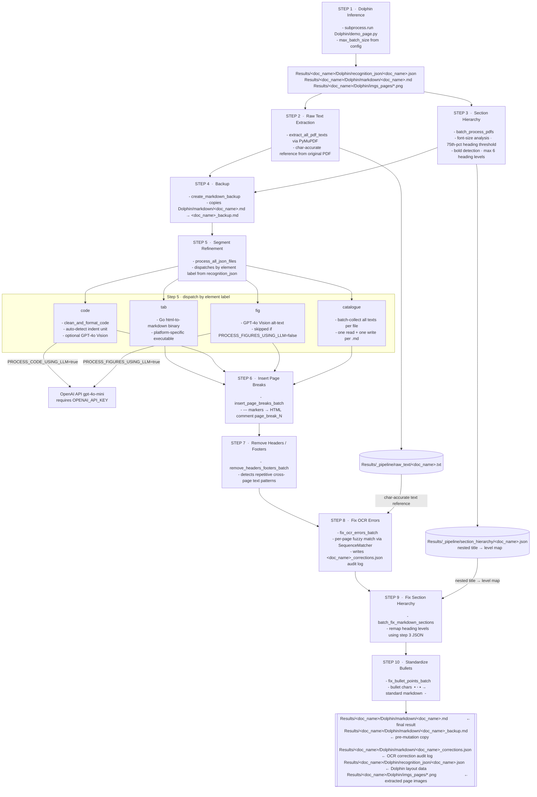

# Pipeline Flow Diagram

```mermaid
flowchart TD
    %% ─────────────────────────── Step 1 ──────────────────────────────────
    S1["STEP 1  ·  Dolphin Inference

    - subprocess.run Dolphin/demo_page.py
    - max_batch_size from config"]
    S1 --> D1["Results/&lt;doc_name&gt;/Dolphin/recognition_json/&lt;doc_name&gt;.json
    Results/&lt;doc_name&gt;/Dolphin/markdown/&lt;doc_name&gt;.md
    Results/&lt;doc_name&gt;/Dolphin/imgs_pages/*.png"]

    %% ─────────────────────────── Step 2 ──────────────────────────────────
    D1 --> S2["STEP 2  ·  Raw Text Extraction

    - extract_all_pdf_texts via PyMuPDF
    - char-accurate reference from original PDF"]
    S2 --> RAW[("Results/_pipeline/raw_text/&lt;doc_name&gt;.txt")]

    %% ─────────────────────────── Step 3 ──────────────────────────────────
    D1 --> S3["STEP 3  ·  Section Hierarchy

    - batch_process_pdfs
    - font-size analysis · 75th-pct heading threshold
    - bold detection · max 6 heading levels"]
    S3 --> HIER[("Results/_pipeline/section_hierarchy/&lt;doc_name&gt;.json
    nested title → level map")]

    %% ─────────────────────────── Step 4 ──────────────────────────────────
    S2 --> S4["STEP 4  ·  Backup

    - create_markdown_backup
    - copies Dolphin/markdown/&lt;doc_name&gt;.md → &lt;doc_name&gt;_backup.md"]
    S3 --> S4

    %% ─────────────────────────── Step 5 ──────────────────────────────────
    S4 --> S5["STEP 5  ·  Segment Refinement

    - process_all_json_files
    - dispatches by element label from recognition_json"]

    subgraph SEG5 ["Step 5 · dispatch by element label"]
        direction LR
        TAB["tab

        - Go html-to-markdown binary
        - platform-specific executable"]
        COD["code

        - clean_and_format_code
        - auto-detect indent unit
        - optional GPT-4o Vision"]
        FIG["fig

        - GPT-4o Vision alt-text
        - skipped if PROCESS_FIGURES_USING_LLM=false"]
        CAT["catalogue

        - batch-collect all texts per file
        - one read + one write per .md"]
    end

    S5 --> TAB & COD & FIG & CAT

    COD -->|"PROCESS_CODE_USING_LLM=true"| OAI
    FIG -->|"PROCESS_FIGURES_USING_LLM=true"| OAI
    OAI["OpenAI API  gpt-4o-mini
    requires OPENAI_API_KEY"]

    %% ─────────────────────────── Steps 6–10 ──────────────────────────────
    TAB & COD & FIG & CAT --> S6

    S6["STEP 6  ·  Insert Page Breaks

    - insert_page_breaks_batch
    - --- markers → HTML comment page_break_N"]
    S6 --> S7["STEP 7  ·  Remove Headers / Footers

    - remove_headers_footers_batch
    - detects repetitive cross-page text patterns"]
    S7 --> S8["STEP 8  ·  Fix OCR Errors

    - fix_ocr_errors_batch
    - per-page fuzzy match via SequenceMatcher
    - writes &lt;doc_name&gt;_corrections.json audit log"]
    RAW -->|"char-accurate text reference"| S8
    S8 --> S9["STEP 9  ·  Fix Section Hierarchy

    - batch_fix_markdown_sections
    - remap heading levels using step 3 JSON"]
    HIER -->|"nested title → level map"| S9
    S9 --> S10["STEP 10  ·  Standardize Bullets

    - fix_bullet_points_batch
    - bullet chars  • ◦ ▪ →  standard markdown  -"]

    %% ─────────────────────────── Output ──────────────────────────────────
    S10 --> OUT[["Results/&lt;doc_name&gt;/Dolphin/markdown/&lt;doc_name&gt;.md                ← final result
    Results/&lt;doc_name&gt;/Dolphin/markdown/&lt;doc_name&gt;_backup.md          ← pre-mutation copy
    Results/&lt;doc_name&gt;/Dolphin/markdown/&lt;doc_name&gt;_corrections.json   ← OCR correction audit log
    Results/&lt;doc_name&gt;/Dolphin/recognition_json/&lt;doc_name&gt;.json       ← Dolphin layout data
    Results/&lt;doc_name&gt;/Dolphin/imgs_pages/*.png                        ← extracted page images"]]
```
